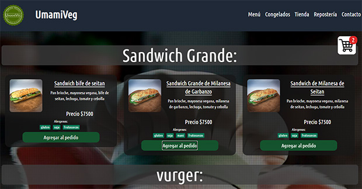
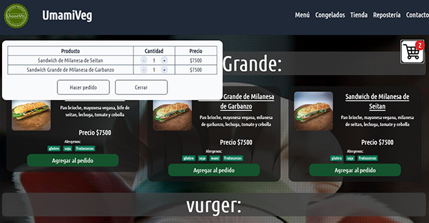

<h1 align="center">
Página UmamiVeg  
</h1>

Página diseñada para un emprendimiento de comida vegana.   
La página es dinámica, y el contenido varia según lo cargado en la base de datos.
La base de datos relacional utilizada y las imágenes estan alojadas en Supabase.  
Los datos de las diferentes páginas de Umamiveg, menú, tienda, congelados y repostería, se cargan utilizando un servicio de CMS creado por mí también, el mismo almadena todos los datos en Supabase. Este CMS tiene varios usos, entre ellos, crear un menú digital accesible con un código QR.

En la página del Menú, es posible agregar productos al carrito y realizar el pedido a través de Whatsapp

 

En la ventana del carrito el cliente puede hacer varios pedidos del mismo producto o eliminarlo.

Al hacer click en el boton "Hacer pedido", un resumen del pedido es enviado via whatsapp, con todos los detalles, cantidades y total. El encargado de recibir el pedido por whatsapp, será el responsable de continuar con el mismo, coordinar los tiempos de entrega y cobro.
Esta página no esta preparada para cobro online, ya que está preparada para facilitar el pedido por whatsapp de una manera más visual y ordenada.
 
<h1>Características:</h1>  

 * El framework utilizado es NEXT.js, ya que es necesario el acceso a la base de datos via servidor.
* Los estilos están hechos con Tailwind CSS
* Las bases de datos y el store de las imágenes están alojadas y gestionadas con Supabase.
 
 <h2>Link a la página:</h2>  

 [Página de UmamiVeg](https://umamiveg.vercel.app/)